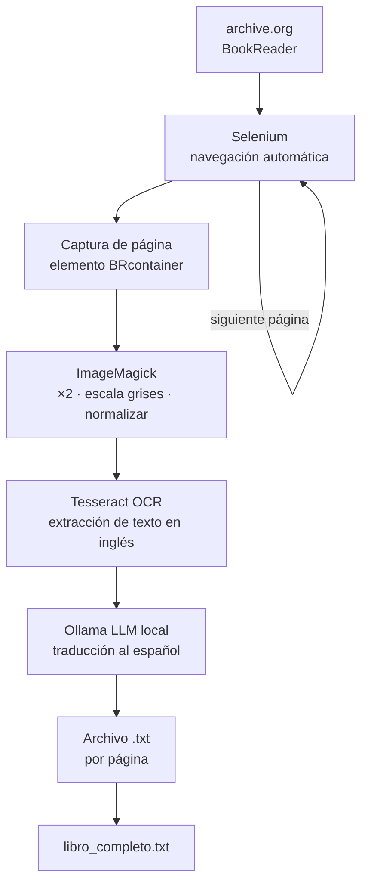

# OCR, Translation & AI Processing Pipeline

[](https://python.org)
[](https://selenium.dev)
[](https://github.com/tesseract-ocr/tesseract)
[](https://ollama.ai/)
[](https://www.gnu.org/software/bash/)

Pipeline de automatización para digitalizar, extraer texto y traducir libros físicos o digitalizados que no están disponibles en bibliotecas o en español.

---

## Origen del proyecto

Este proyecto nació de una necesidad concreta: **obtener el contenido de *Systemantics* de John Gall**, un libro que no aparecía disponible en ninguna biblioteca física ni en traducción al español, pero sí estaba digitalizado en [archive.org](https://archive.org/details/systemanticshows00gall).

### ¿Qué es *Systemantics*?

*Systemantics* (1975, John Gall) es un ensayo sobre el comportamiento de los sistemas complejos y, sobre todo, sobre **por qué fallan**. Su premisa central es tan simple como demoledora:

> *"Systems in general work poorly or not at all."*

El libro enumera una serie de leyes sobre el comportamiento de los sistemas, escritas con ironía pero fundamentadas en observación real:

- Los sistemas nuevos generan nuevos problemas que no existían antes
- Los sistemas tienden a crecer más allá de su propósito original
- Un sistema complejo que funciona invariablemente ha evolucionado desde un sistema simple que funcionaba — un sistema complejo diseñado desde cero nunca funciona
- Los sistemas complejos operan habitualmente en modo de fallo
- Los sistemas desarrollan objetivos propios en cuanto son creados

Su relevancia en informática es directa. Cualquier arquitecto de software, ingeniero de sistemas o desarrollador reconocerá estas leyes en su trabajo cotidiano: el *feature creep*, los efectos no esperados de un despliegue, los sistemas legados que nadie entiende pero nadie se atreve a tocar. Gall escribió sobre burocracia e instituciones, pero describió sin saberlo el ciclo de vida del software empresarial.

La automatización — el campo que hace posible este pipeline — es también una forma de construir sistemas. Y por tanto, está sujeta a las mismas leyes.

---

## Qué hace este pipeline

La imposibilidad de encontrar el libro en papel o en español llevó a construir una solución técnica que hace exactamente lo que la informática permite: **automatizar la extracción de información de una fuente digital y transformarla en un formato utilizable**.



El proceso es completamente local: ningún texto sale fuera de la máquina. No hay APIs externas ni terceros involucrados en la traducción.

---

## Scripts

### `digitalizar_libro.py` — pipeline completo automatizado

Automatiza la digitalización de un libro en archive.org en modo 2up (dos páginas por pantalla):

1. Abre Chrome con Selenium y navega a la URL del libro
2. Espera que las imágenes de cada página estén completamente cargadas
3. Captura el área exacta del BookReader (sin UI del navegador)
4. Preprocesa la imagen con ImageMagick para mejorar la precisión del OCR
5. Extrae el texto con Tesseract
6. Traduce con un modelo local de Ollama
7. Guarda cada doble página en un archivo `.txt` independiente
8. Al terminar, concatena todo en `libro_completo.txt`
9. Es reanudable: si se interrumpe, retoma desde donde lo dejó

**Configuración** (sección `CONFIGURACIÓN` al inicio del script):

```python
BOOK_ID    = "systemanticshows00gall"  # ID del libro en archive.org
PAGE_START = 1       # hoja desde donde empezar
PAGE_END   = 135     # última hoja
PAGE_STEP  = 2       # modo 2up: avanzar de 2 en 2
MODELO     = "qwen3:14b"  # modelo Ollama para traducción
```

**Uso:**

```bash
conda activate openinterpreter
python digitalizar_libro.py
```

Al arrancar se abre el libro en Chrome. Tienes 50 segundos para hacer login en archive.org si es necesario. Luego el proceso es completamente automático.

**Salida:** `traduccion_systemantics/pagina_XXXX_nYY.txt` + `libro_completo.txt`

---

### `Systemantics/procesarAI.sh` — script de una sola imagen

Versión básica en Bash para procesar una imagen puntual:

```bash
conda activate openinterpreter  # o cualquier entorno con las dependencias
cd Systemantics
chmod +x procesarAI.sh
./procesarAI.sh
```

Pide el nombre de la imagen (sin `.png`), genera `nombre_pre.png` (preprocesada) y traduce el texto OCR por pantalla.

---

## Instalación

```bash
# Dependencias de sistema
sudo apt-get install tesseract-ocr imagemagick

# Ollama
curl -fsSL https://ollama.ai/install.sh | sh
ollama pull qwen3:14b   # modelo recomendado para traducción

# Entorno Python
conda activate openinterpreter  # selenium + Pillow + webdriver_manager ya incluidos
```

---

## Tech Stack

| Componente | Herramienta | Función |
|-----------|-------------|---------|
| Automatización web | Selenium + ChromeDriver | Navegar y capturar páginas del BookReader |
| Procesado de imagen | ImageMagick + PIL | Preproceso para mejorar OCR |
| OCR | Tesseract 5 | Extracción de texto en inglés |
| Traducción | Ollama (`qwen3:14b`) | Traducción local inglés → español |
| Orquestación | Python 3.11 | Pipeline completo |
| Script rápido | Bash | Procesado de imagen individual |

---

## GPU remota (opcional)

Si el modelo Ollama es lento en local, conecta a un servidor con GPU mediante túnel SSH:

```bash
ssh -L 11434:localhost:11434 usuario@servidor-gpu
```

---

## Autor

**Alberto Jiménez** — [datablogcafe.com](https://datablogcafe.com) | [GitHub](https://github.com/albertjimrod)

---

## Uso responsable

Este script es una herramienta de automatización de propósito general. El código en sí no contiene ni distribuye contenido con copyright.

El usuario es responsable de asegurarse de que tiene acceso legítimo al contenido que procesa (libro prestado, dominio público, licencia abierta) y de que el uso que hace del resultado es personal o educativo. No está pensado para la distribución masiva de contenido protegido.

---

## Licencia

MIT License
